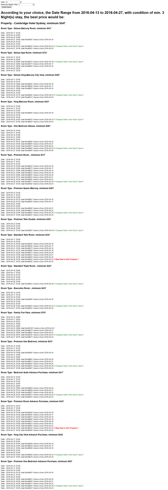

# Back-end Development Test

### Fastrack Group

The purpose of this test is to not only gauge the capabilities of potential applicants, but to also get an idea of their approach to development and problem-solving.

To complete this test, fork the repository to your own public Git repo, complete the task, and then email the URL of your repo to development@fastrackg.com.  Include any instructions of any necessary steps to get your code working in the README file (e.g. installing Composer dependencies).

## The Task

You are required to reproduce a small piece of core functionality found within our own custom Content Management System.  Fastrack Group works for a wide range of clients within the tourism and accommodation industries, so there is an inevitable amount of integration required with third-party booking systems.

You are required to write the code necessary to query the API for [TheBookingButton](http://www.siteminder.com/the-booking-button/) to retrieve the best room rates for a hotel.

The full documentation for TheBookingButton rates API can be found at https://help.thebookingbutton.com/hc/en-us/articles/203326314-TheBookingButton-Rates-API

For the sake of this exercise use the channel code `camhotsyddirect` when retrieving rates.  The region for this demonstration property is APAC.

Your solution must:
* Display the best **available** rate for each room type over the coming 21 days
* Display when the above best rate is for
* Display the **overall** best availale rate for the hotel - including the date and the room type

It is up to your discretion how to display these results - this is not a design or front-end development test.  A command-line solution is just as valid as browser-based output.

## Restrictions

Your solution must be written in PHP.  You may support whatever version(s) of PHP that you wish, but you must include details of those requirements in your README file.

You may use whatever tools and/or frameworks you wish to get the job done.

Your code must be fully commented to explain what is happening.

## Extra Credit

If you have time and are inspired to delve a little further into this, feel free to look at any of the below:
* Expand the search window to capture the best rate over the next **60 days**.
* We know that we want to stay for three nights at this hotel - update your code to calculate the best available rates for three consecutive nights.

If you attempt any of these, make a note in your README file.

## Feedback from Yannick in 2016/04/13 18:00
1. The tasks completed with all conditions; that means user can search ranged from today to the coming 7 days to 60 days. The default in HTML form is 14 days, but in PHP codes would be 21 days
2. Users can query any stay from 1 night to 5 consecutive nights.
3. The php codes in the [content.php](content.php)
4. The demo would be accessed from [http://yannicklin.net/razor/content.php](http://yannicklin.net/razor/content.php)
5. the screenshot would be 

